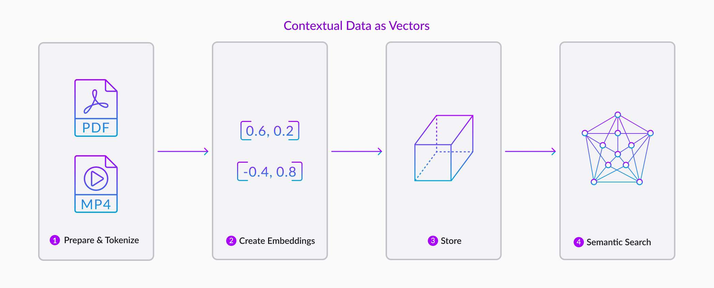
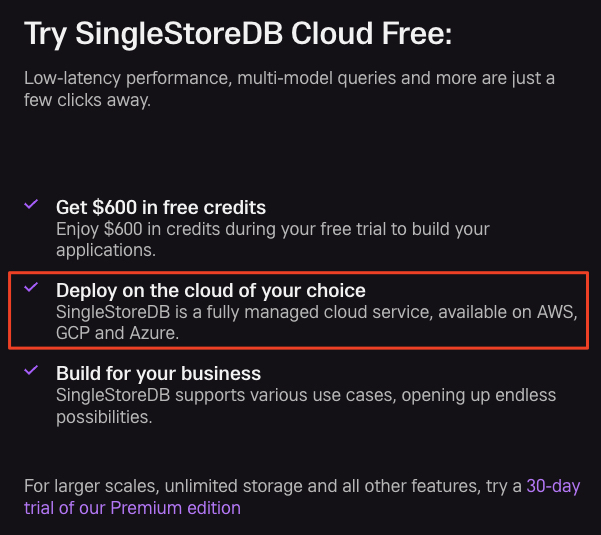
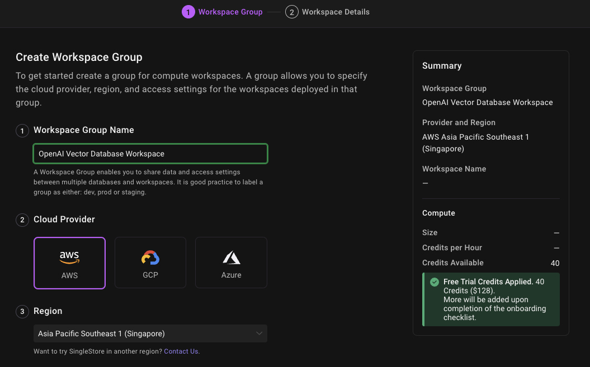
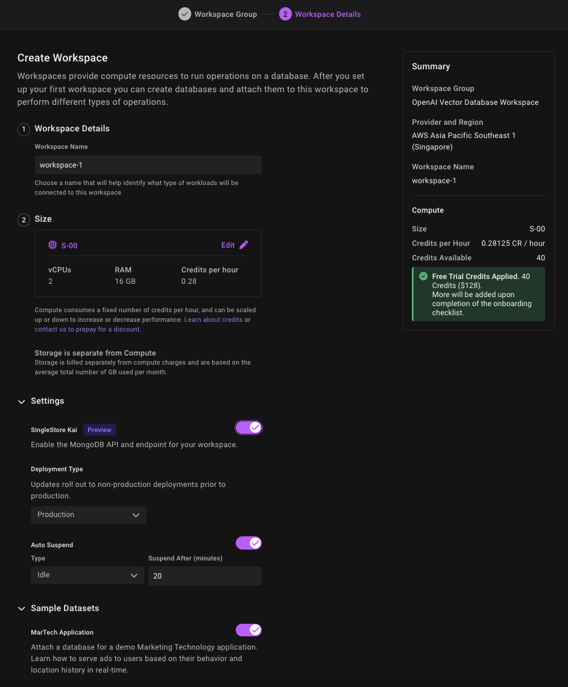
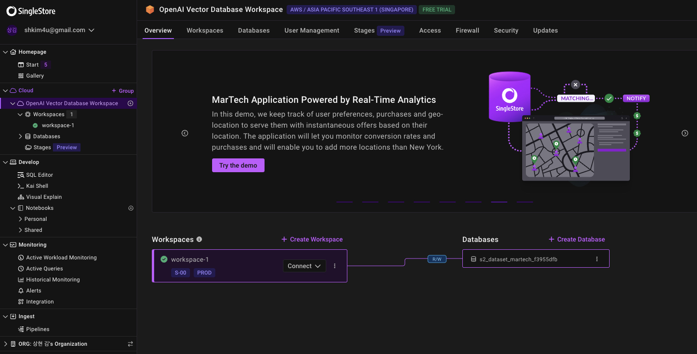
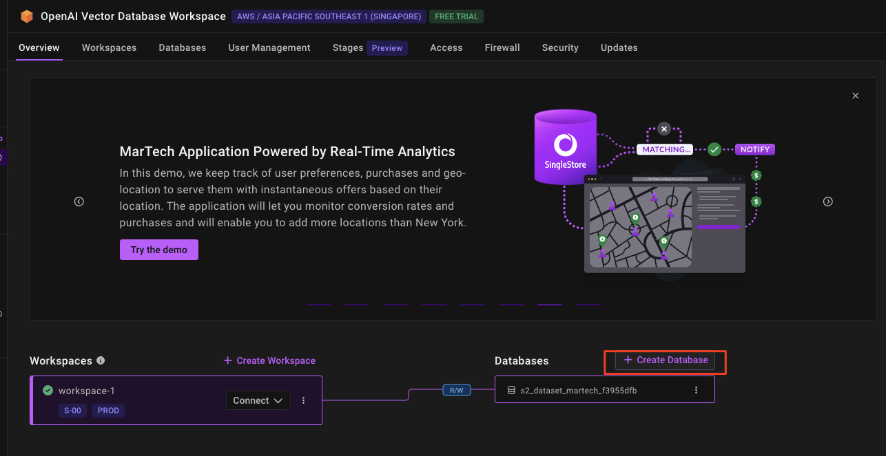
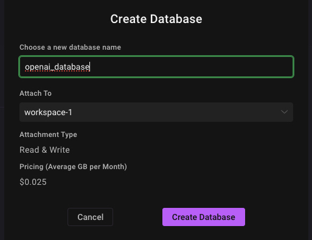
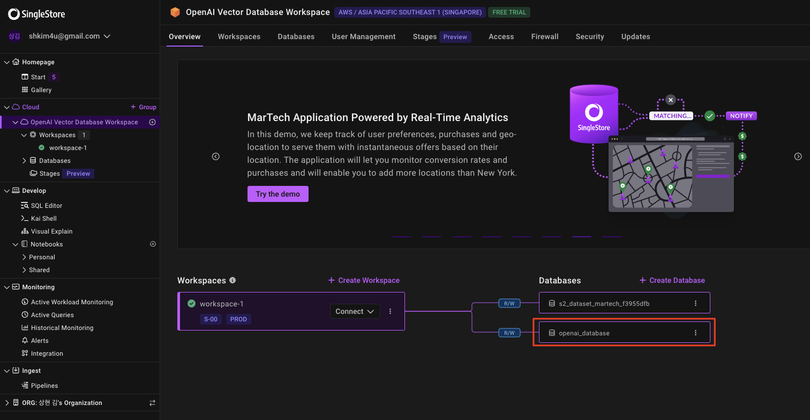
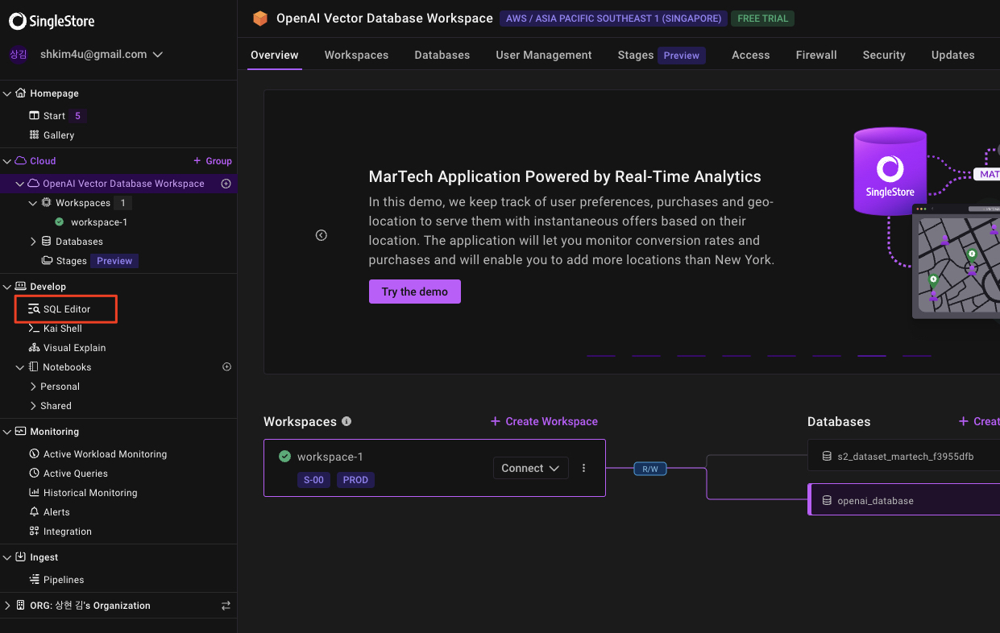

# 1. Scripts
## 1.1. Create a vector database using ```SingleStore```
1. Create an account in ```SingleStore``` and get onboard onto it, which is a vector database service provider.<br>
  * [SingleStore](https://www.singlestore.com/): Real-time Unified Distributed SQL and Built-in Vector Database
  * [SingleStore Built-in Vector Database](https://www.singlestore.com/built-in-vector-database/)<br>
    * 
  * Can utilize storage provided by cloud service providers, including AWS S3.
    * 
  * Choose AWS as cloud provider.
    * 
    * Workspace Group Name: ```OpenAI Vector Database Workspace```
    * 
  * SingleStore onboarding and creeating workspace completed.
    * 

2. Create a vector database and a table.<br>
* Create a vector database.<br>
  * <br>
  * Database Name: ```openai_database```
  * <br>
  * 
* Create a table.<br>
  * Select ```SQL Editor```.<br>
    * 

## 1.2. Do some embeddings using OpenAI API.
1. Create an embeddings for initial input on OpenAI API.
	```bash
	# (Note) OPENAI_API_KEY should be defined in environment variable.
	curl https://api.openai.com/v1/embeddings \
		-H "Content-Type: application/json" \
		-H "Authorization: Bearer $OPENAI_API_KEY" \
		-d '{
			"input": "Your text string goes here",
			"model": "text-embedding-ada-002"
		}'
	```

	혹은 ```Postman```과 같은 도구를 사용할 수 있습니다.<br>
	

	> (참고) t-SNE (t-Distributed Stochastic Neighbor Embeddings)<br>
 	> t-SNE, which stands for t-distributed stochastic neighbor embedding, is a machine learning algorithm used for visualizing high-dimensional data in a lower-dimensional space, typically two or three dimensions. It is particularly useful for visualizing how data points are clustered and for revealing patterns that may not be apparent in higher dimensions.<br><br>
	The algorithm works by measuring the similarity between data points in high-dimensional space and representing these similarities as probabilities. It then seeks to minimize the difference between these probabilities in the high-dimensional space and the lower-dimensional space, effectively mapping the data points to their new lower-dimensional positions in such a way that similar data points remain close to each other.<br><br>
	t-SNE is commonly used in exploratory data analysis, dimensionality reduction, and visualization of complex datasets, particularly in fields such as machine learning, bioinformatics, and natural language processing. It is worth noting that while t-SNE can provide valuable insights into the underlying structure of data, its results should be interpreted with care and in combination with other analytical techniques due to its sensitivity to different parameter settings.<br><br>
	In summary, t-SNE is a powerful tool for visualizing high-dimensional data and understanding the inherent structure of the data, allowing for effective exploratory analysis and insights into complex datasets.  

* Then, create an embedding for more complex input using OpenAI API.
	```bash
	curl --location 'https://api.openai.com/v1/embeddings' \

	--header 'Content-Type: application/json' \
 	--header 'Authorization: Bearer $OPENAI_API_KEY' \
	--data '{
			"input": "Contractor will submit invoices to Mercy Corps in accordance with the invoicing schedule and invoicing delivery terms set forth in the Statement of Services (Schedule I). Final invoices must be submitted within 60 days of the end date of the Contract. Contractor recognizes that in many cases Mercy Corps’ donor will not reimburse Mercy Corps for invoices submitted beyond 60 days after the termination of a contract and therefore Mercy Corps will have no obligation to pay any portion of invoices received more than 60 days after the end date of the Contract. Each invoice will include (i) the Contract Number; (ii) Contractor’s name and address; (iii) a description of the Services performed, (iv) the dates such Services were performed, (v) a pricing calculation based on the payment terms, (vi) properly reimbursable expenses (if any) incurred along with receipts for such expenses (if applicable) for all individual expenses exceeding $25 USD, and (vii) such other information as Mercy Corps may reasonably request.  Invoices will only be deemed received on the date they are delivered to the Authorized Representative pursuant to the Payment Terms (see Schedule I).  If Mercy Corps determines that Services that are the subject of an invoice have not been performed in accordance with the Statement of Services, Mercy Corps may dispute the invoice by sending Contractor notice of such dispute after Mercy Corps’ receipt of the invoice. Such notice shall clearly state the specific Services disputed, and Mercy Corps’ reason for disputing the performance of the Services. If both parties accept the dispute of the invoice, they shall agree in writing as to the steps required of Contractor to ensure that the performance of the disputed Services is subsequently completed in accordance with the Additional Terms, and the time required of Contractor to complete the Services.",
			"model": "text-embedding-ada-002"
	}'
	```

# 2. References
1. YouTube Contents
	- [YouTube Channel](https://www.youtube.com/watch?v=ySus5ZS0b94&ab_channel=AdrianTwarog)

2. OpenAI
	- [OpenAI Blog Post on API](https://openai.com/blog/openai-api/)
	- [OpenAI Embeddings](https://platform.openai.com/docs/guides/embeddings/what-are-embeddings)