# 1. ```SingleStore```를 활용한 벡터 데이터베이스 생성
1. 벡터 데이터베이스 서비스를 제공하는 ```Singlestore```에 계정을 만들고 Onboarding 합니다.<br>
     * [SingleStore](https://www.singlestore.com/): 실시간 통합 분산 SQL 실행 및 내장 벡터 데이터베이스 제공합니다.
     * [SingleStore Built-in Vector Database](https://www.singlestore.com/built-in-vector-database/)<br>
       * 
     * AWS S3을 포함하여 클라우드 서비스 제공 업체가 제공하는 스토리지를 활용할 수 있습니다.
       * 
     * 클라우드 제공 업체로 AWS를 선택합니다.
       * 
       * Workspace Group Name: ```OpenAI Vector Database Workspace```
       * 
     * Singlestore Onboarding 및 Workspace 생성이 완료되면 다음으로 진행하세요.
       * 

2. 벡터 데이터베이스와 테이블을 생성합니다.<br>
   * 벡터 데이터베이스를 생성<br>
     * <br>
     * 데이터베이스 이름`openai_database```
     * <br>
     * 
   * 테이블 생성<br>
     * ```SQL Editor``` 선택<br>
       * 
     * 아래 DDL 문으로 테이블을 만듭니다.<br>
		```sql
		CREATE TABLE IF NOT EXISTS vectortable (
			text TEXT,
			vector BLOB
		);
		```

		 * 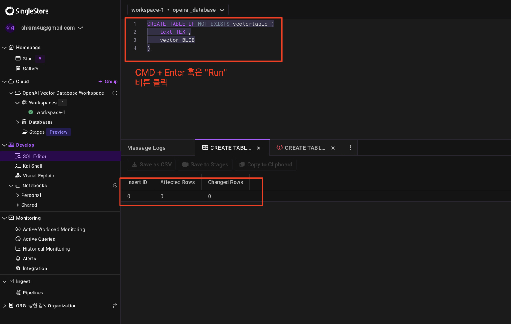<br>
		 * 아래와 같이 생성된 테이블을 볼 수 있습니다.<br>
  		 * 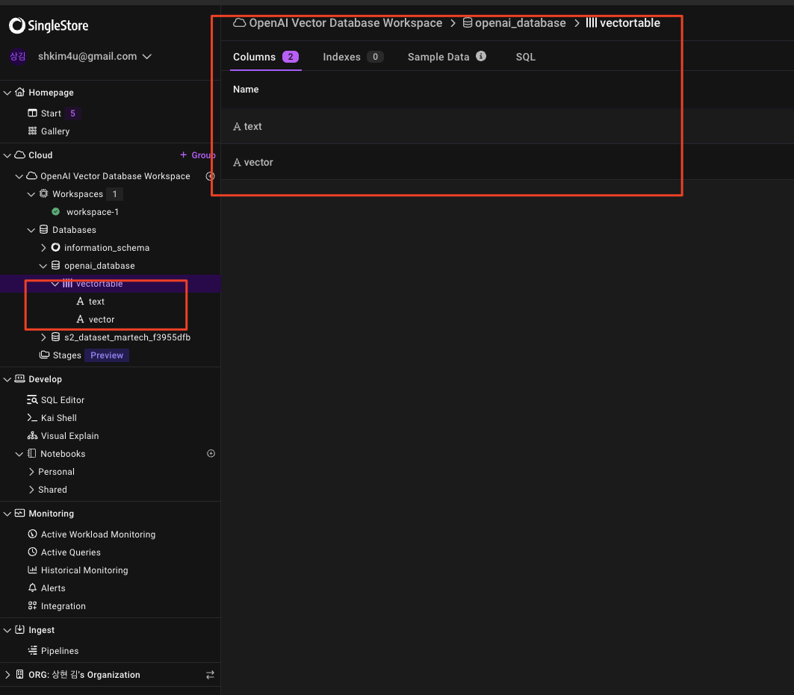

3. 우리는 다음 섹션에서 몇몇 텍스트와 해당 텍스트에 대한 벡터 공간 내 임베딩 값을 OpenAI API를 통해 생성한 후 생성된 테이블에 입력할 것입니다.

# 2. OpenAI API를 사용한 임베딩<br>

1. OpenAI API를 통해 초기 입력값 (```Hello World```)에 대한 임베딩을 생성합니다.

```bash
# (Note) OPENAI_API_KEY should be defined in environment variable.
curl https://api.openai.com/v1/embeddings \
-H "Content-Type: application/json" \
-H "Authorization: Bearer $OPENAI_API_KEY" \
-d '{
    "input": "Hello World",
    "model": "text-embedding-ada-002"
}'
```

혹은 ```Postman```과 같은 도구를 사용할 수 있습니다.<br>


> (참고) `t-SNE (t-Distributed Stochastic Neighbor Embeddings)`<br>
> `t-분포 확률론적 이웃 임베딩`인 t-SNE는 저차원 공간, 일반적으로 2~3 차원에서 고차원 데이터를 시각화하는 데 사용되는 기계 학습 알고리즘입니다. 데이터 포인트가 클러스터링되는 방식을 시각화하고 더 높은 차원에서는 명백하지 않은 패턴을 드러내는데 특히 유용합니다.<br><br>
이 알고리즘은 고차원 공간의 데이터 포인트 간의 유사성을 측정하고 이러한 유사성을 확률로 표시함으로써 작동합니다. 그런 다음 고차원 공간과 하부 차원 공간의 이러한 확률 간의 차이를 최소화하여 유사한 데이터 포인트가 서로 가까이 유지되는 방식으로 데이터 포인트를 새로운 차원 위치에 효과적으로 매핑합니다.<br><br>
`t-SNE`는 일반적으로 탐색적 데이터 분석, 차원 감소 및 복잡한 데이터 세트, 특히 기계 학습, 생물 정보학 및 자연어 처리와 같은 분야의 시각화에 사용됩니다. `t-SNE`는 데이터의 기본 구조에 대한 귀중한 통찰력을 제공할 수 있지만, 그 결과는 서로 다른 매개 변수 설정에 대한 민감도로 인해 다른 분석 기술과 함께 주의하면서 사용되어야 합니다.<br><br>
요약하면, `t-SNE`는 고차원 데이터를 시각화하고 데이터의 고유한 구조를 이해하기 위한 강력한 도구이며, 효과적인 탐색적 분석과 복잡한 데이터 세트에 대한 통찰력이 가능하게 합니다.<br>
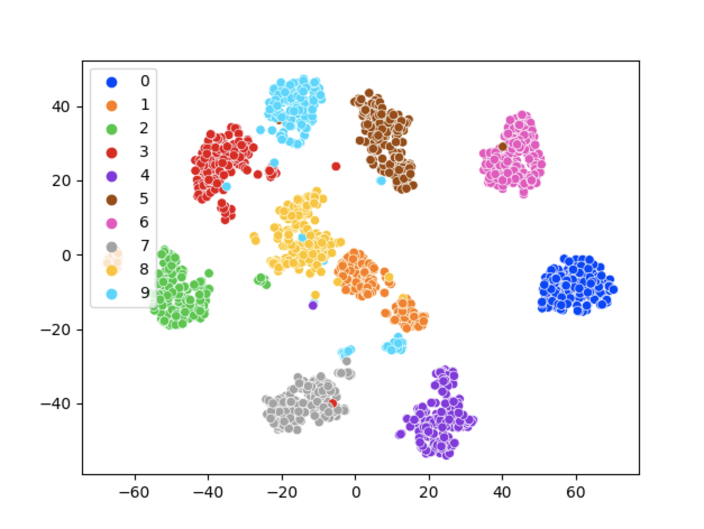

응답 데이터 (JSON 배열)을 기록하고 해당 값을 원본 텍스트와 함께 벡터 테이블에 입력합니다.<br>

* Postman 실행 결과로부터 Embedding 값 복사<br>
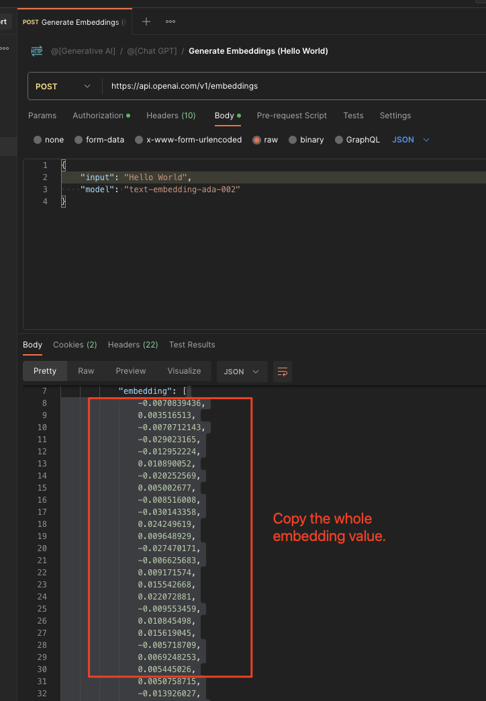

* SingleStore SQL Editor에서 텍스트 값과 임베딩을 Insert<br>
```sql
INSERT INTO vectortable (text, vector) VALUES ("Hello World", JSON_ARRAY_PACK("[
    -0.0070839436,
    0.003516513,
    -0.0070712143,
    ... -- Deleted for brevity.
]"));
```
 <br>

 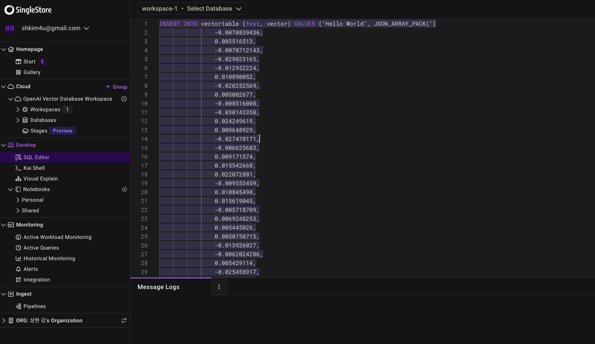<br>

* 벡터 테이블에 Insert된 값<br>
 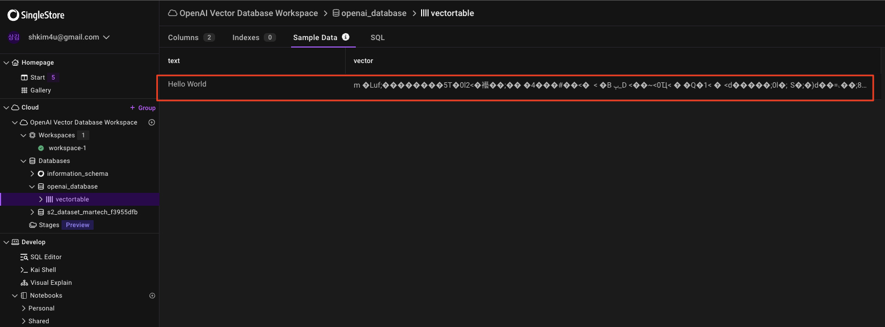

2. 좀 더 복잡한 텍스트에 대해 더 많은 임베딩을 만들고 벡터 스토어에 저장해 봅니다.<br>
> **<u>특히 `Amazon`과 관련된 상반된 두 개의 입력 (회사로서의 Amazon과 지역으로서의 Amazon)을 생성한 후 어느 쪽이 `Amazon`이라는 단어와 좀 더 유사한지 살펴 봅니다.</u>**<br>

* (1) ```Amazon EKS Announces 99.9% Service Level Agreement```<br>
[[AWS 기사 링크]](https://aws.amazon.com/about-aws/whats-new/2019/01/-amazon-eks-announces-99-9--service-level-agreement-/?nc1=h_ls)

```bash
curl --location 'https://api.openai.com/v1/embeddings' \
--header 'Content-Type: application/json' \
--header 'Authorization: Bearer $OPENAI_API_KEY' \
--data '{
    "input": "Amazon EKS Announces 99.9% Service Level Agreement",
    "model": "text-embedding-ada-002"
}'
```

```sql
INSERT INTO vectortable (text, vector) VALUES ("Amazon EKS Announces 99.9% Service Level Agreement", JSON_ARRAY_PACK("[
    -0.0070839436,
    0.003516513,
    -0.0070712143,
    ... -- Deleted for brevity.
]"));
```

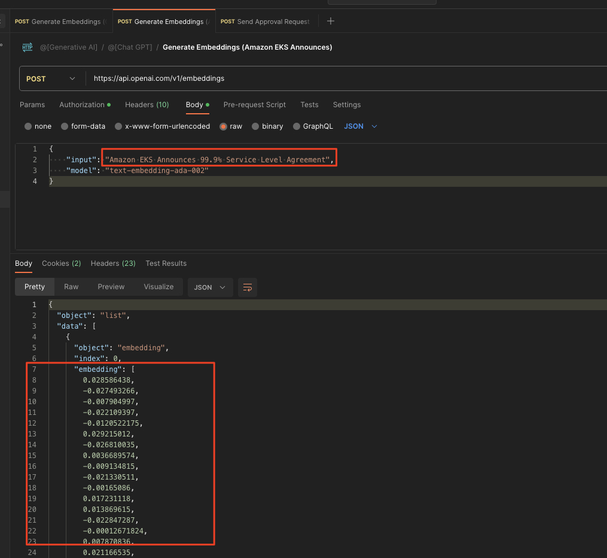<br>
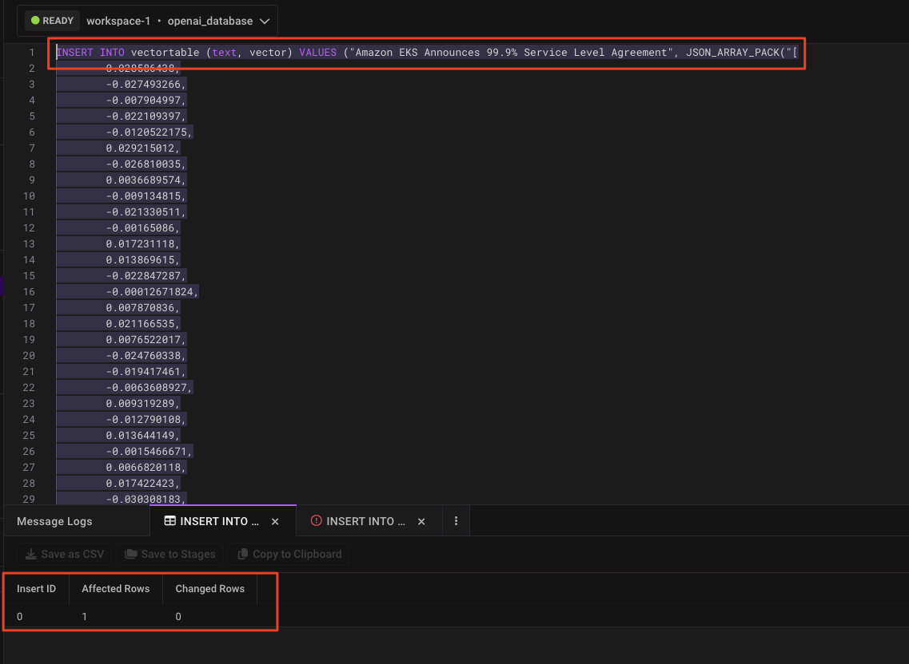<br>
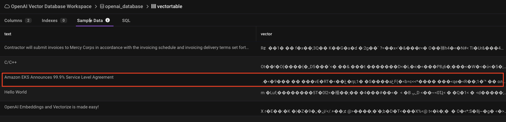<br>

* (2) ```Deforestation of the Amazon rainforest in Brazil has surged to its highest level since 2008```<br>
[[뉴스 링크]](https://www.bbc.com/news/world-latin-america-55130304)

```bash
curl --location 'https://api.openai.com/v1/embeddings' \
--header 'Content-Type: application/json' \
--header 'Authorization: Bearer $OPENAI_API_KEY' \
--data '{
    "input": "Deforestation of the Amazon rainforest in Brazil has surged to its highest level since 2008",
    "model": "text-embedding-ada-002"
}'
```

```sql
INSERT INTO vectortable (text, vector) VALUES ("Deforestation of the Amazon rainforest in Brazil has surged to its highest level since 2008", JSON_ARRAY_PACK("[
    -0.0070839436,
    0.003516513,
    -0.0070712143,
    ... -- Deleted for brevity.
]"));
```

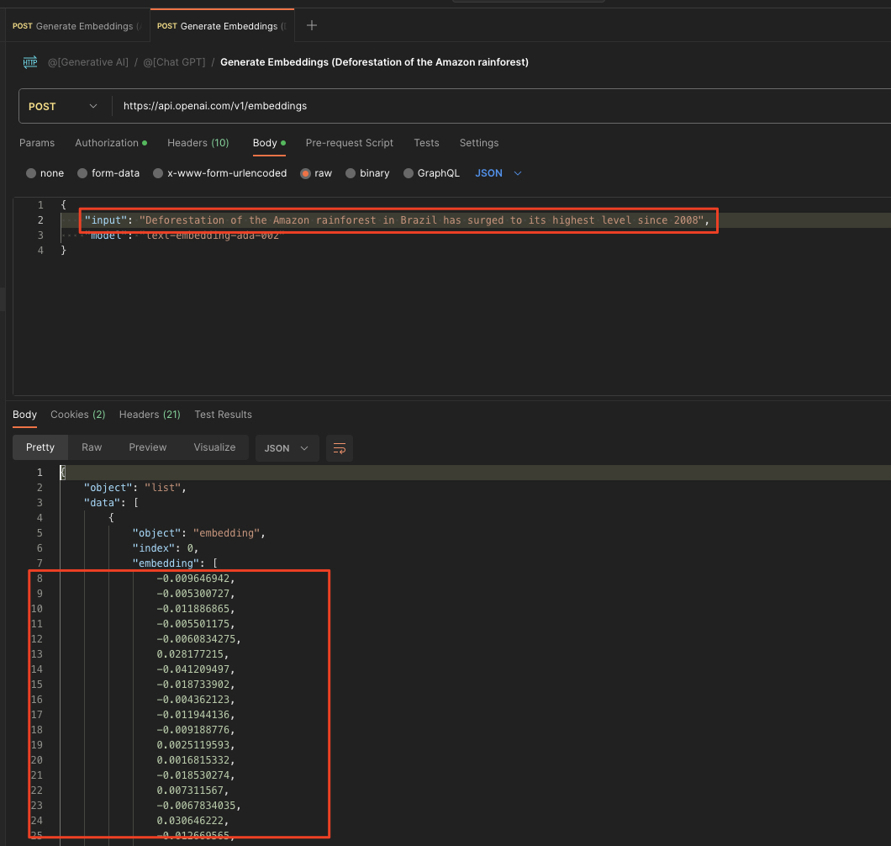<br>
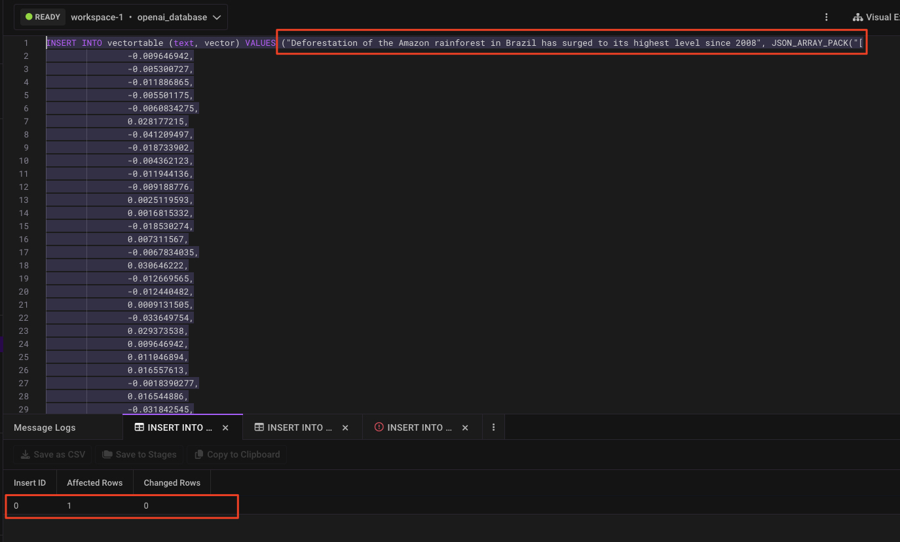<br>
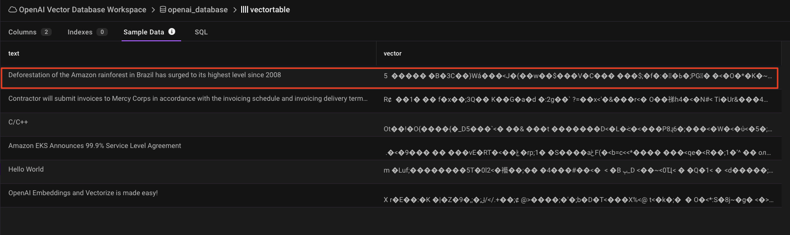<br>

* (3) (Optional) ```OpenAI Embeddings and Vectorize is made easy!```<br>
추가적인 테스트를 위해 몇몇 문장에 대해 임베딩을 추가로 생성해 봅니다.<br>

```bash
curl --location 'https://api.openai.com/v1/embeddings' \
--header 'Content-Type: application/json' \
--header 'Authorization: Bearer $OPENAI_API_KEY' \
--data '{
    "input": "OpenAI Embeddings and Vectorize is made easy!",
    "model": "text-embedding-ada-002"
}'
```

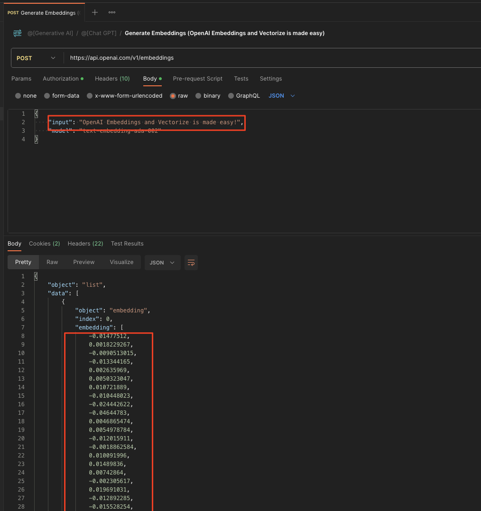<br>
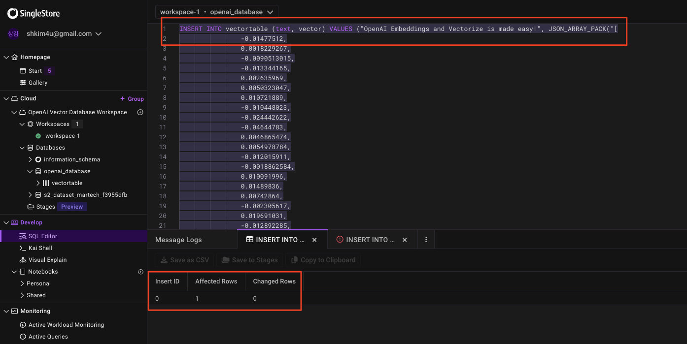<br>
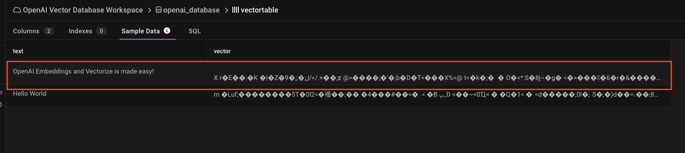<br>

* (4) (Optional) Sample Contract Text<br>
```bash
curl --location 'https://api.openai.com/v1/embeddings' \
--header 'Content-Type: application/json' \
--header 'Authorization: Bearer $OPENAI_API_KEY' \
--data '{
    "input": "Contractor will submit invoices to Mercy Corps in accordance with the invoicing schedule and invoicing delivery terms set forth in the Statement of Services (Schedule I). Final invoices must be submitted within 60 days of the end date of the Contract. Contractor recognizes that in many cases Mercy Corps’ donor will not reimburse Mercy Corps for invoices submitted beyond 60 days after the termination of a contract and therefore Mercy Corps will have no obligation to pay any portion of invoices received more than 60 days after the end date of the Contract. Each invoice will include (i) the Contract Number; (ii) Contractor’s name and address; (iii) a description of the Services performed, (iv) the dates such Services were performed, (v) a pricing calculation based on the payment terms, (vi) properly reimbursable expenses (if any) incurred along with receipts for such expenses (if applicable) for all individual expenses exceeding $25 USD, and (vii) such other information as Mercy Corps may reasonably request.  Invoices will only be deemed received on the date they are delivered to the Authorized Representative pursuant to the Payment Terms (see Schedule I).  If Mercy Corps determines that Services that are the subject of an invoice have not been performed in accordance with the Statement of Services, Mercy Corps may dispute the invoice by sending Contractor notice of such dispute after Mercy Corps’ receipt of the invoice. Such notice shall clearly state the specific Services disputed, and Mercy Corps’ reason for disputing the performance of the Services. If both parties accept the dispute of the invoice, they shall agree in writing as to the steps required of Contractor to ensure that the performance of the disputed Services is subsequently completed in accordance with the Additional Terms, and the time required of Contractor to complete the Services.",
    "model": "text-embedding-ada-002"
}'
```

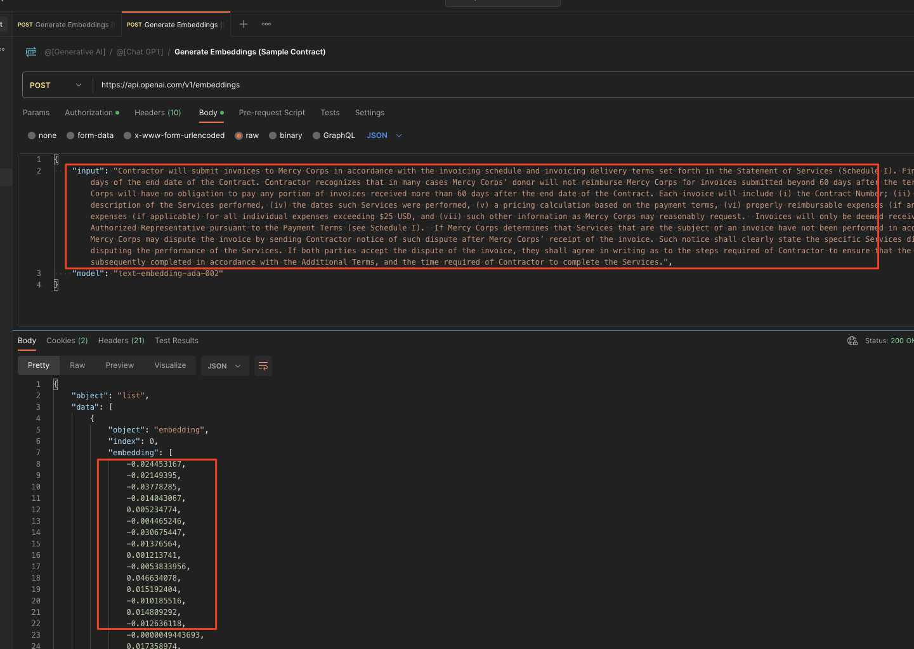<br>
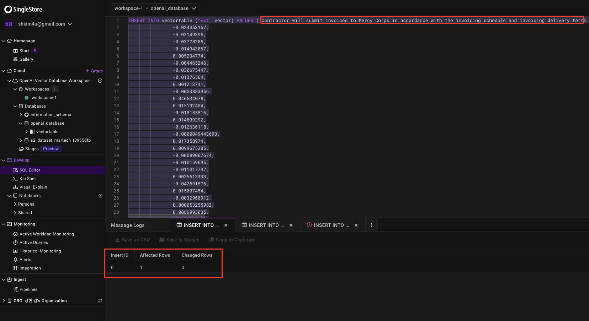<br>
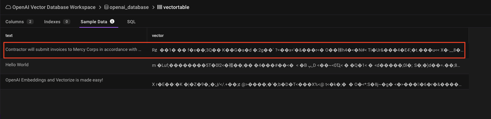<br>

# 3. 임베딩 검색<br>
이제 `Amazon`이라는 단어에 대해 상반된 Semantic을 가지는 위 두 개 문장의 벡터 임베딩과 비교하기 위해 `Amazon`이라는 단어 자체의 임베딩 값을 생성합니다.<br>

1. 검색을 위한 임베딩 생성<br>
   * 검색을 위한 단어: ```Amazon```<br>
   * Using ```curl``` command 
       ```bash
       curl --location 'https://api.openai.com/v1/embeddings' \
        --header 'Content-Type: application/json' \
        --header 'Authorization: Bearer $OPENAI_API_KEY' \
        --data '{
            "input": "Amazon",
            "model": "text-embedding-ada-002"
        }'
       ```
   * Using ```Postman```<br>
        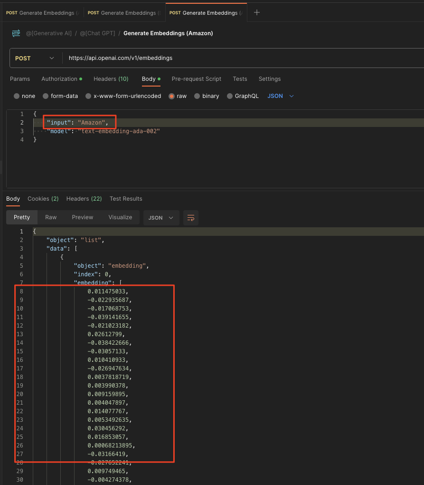<br>
   <!-- * 다음 단계를 위햐 응답값에서 임베딩을 복사해 둡니다.<br> -->

2. **<u>(Key Point) 벡터 데이터베이스에서 임베딩을 검색합니다.</u>**<br>
   * 해당 벡터 임베딩 값과 `DOT_PRODUCT` 연산으로 계산된 값이 가장 큰 순위를 가진 텍스트를 순서대로 표시해 봅니다. 이 때 아래 SQL 문에서 `JSON_ARRAY_PACK` 내의 값을 위에서 반환된 임베딩 값으로 대체해 줍니다.<br> 
     ```sql
     SELECT text, DOT_PRODUCT(vector, JSON_ARRAY_PACK("[
         -0.011825546,
         -0.014264866,
         -0.010375697,
         ... -- Deleted for brevity.
     ]")) AS score
     FROM vectortable
     ORDER BY score DESC
     LIMIT 10;
     ```
    * ***<u>아래에서 볼 수 있듯이 유사성 점수가 가장 큰 텍스트는 ```Amazon EKS Announces 99.9% Service Level Agreement```이고, 다음으로 유사한 텍스트는 ```Deforestation of the Amazon rainforest in Brazil has surged to its highest level since 2008```입니다.</u>***<br>
    * 아마존 유역의 남아메리카 국가 국민들이나 아마존 열대 우림 원주민들은 이 결과를 좋아하지 않을 것 같습니다!^^<br>
      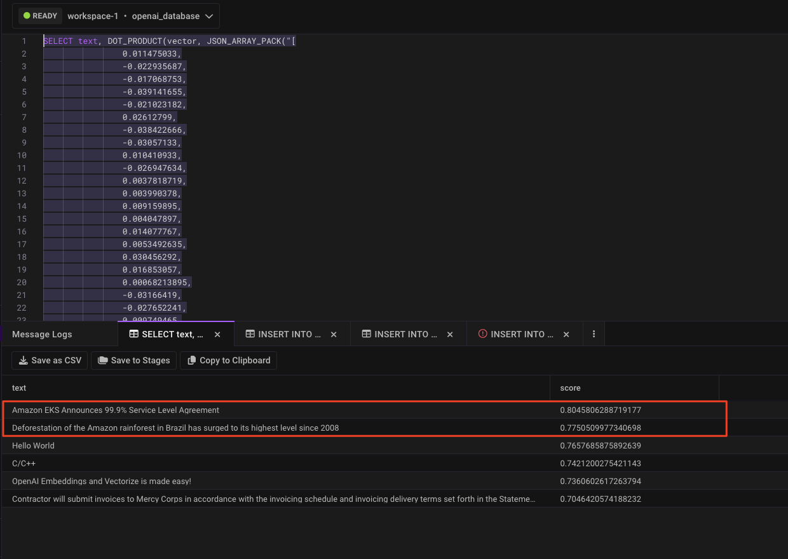<br>  

3. OpenAI의 임베딩이 어떻게 작동하는지 명확하게 하기 위해 더 많은 단어와 임베딩으로 검색해 봅니다.<br>
    * Recommended words
      * ```Cloud Computing```, ```Biodiversity```, ```Virtualization```, etc.
    <!-- * ```LLM```<br>
      * 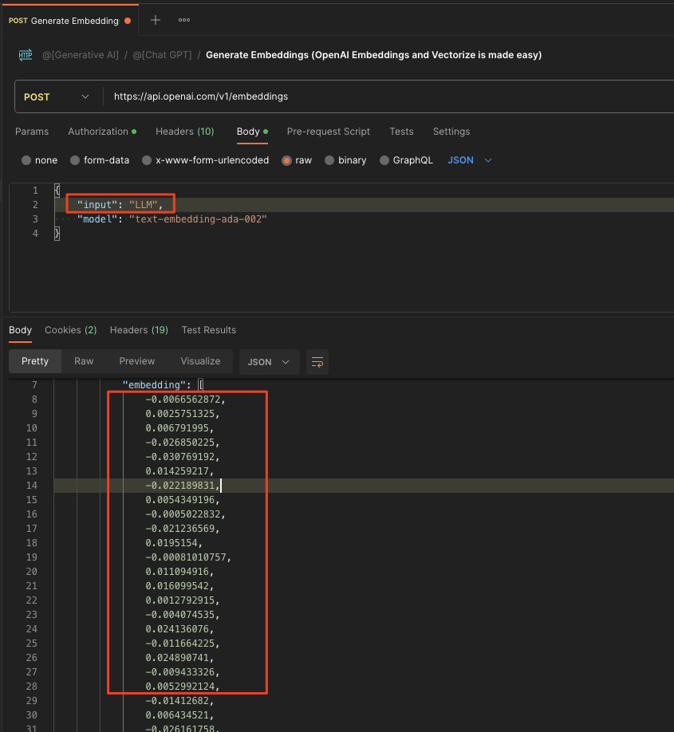<br>
      * 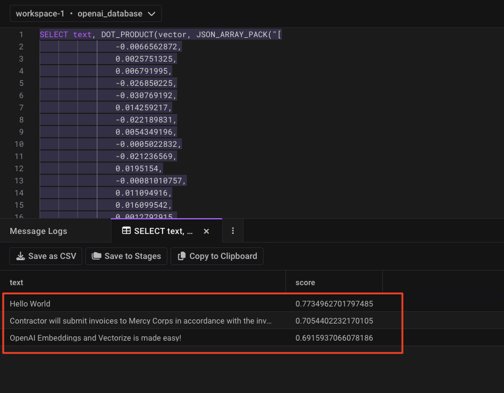<br>
      * 아마도 Cut-off 일자가 ```LLM```과 ```OpenAI``` 연관 랭크가 낮은데 영향을 끼쳤을 수도 있을 듯.<br>
      * ```Deep Learning``` 등으로도 추가 테스트<br>
    * 만약 결과가 잘 안나오면 보편적인 토픽으로 Embedding 검색을 시도해 볼 것.
      * 예를 들어 "C/C++"로 Embedding 값을 생성한 후 Vector Table에 Insert.
      * 이후에 ```DOT_PRODUCT```를 ```Pointer```라는 단어로 수행해 볼 것. -->

# 4. References

[//]: # (1. YouTube Contents)

[//]: # (	- [YouTube Channel]&#40;https://www.youtube.com/watch?v=ySus5ZS0b94&ab_channel=AdrianTwarog&#41;)

1. OpenAI
	- [OpenAI Blog Post on API](https://openai.com/blog/openai-api/)
	- [OpenAI Embeddings](https://platform.openai.com/docs/guides/embeddings/what-are-embeddings)
