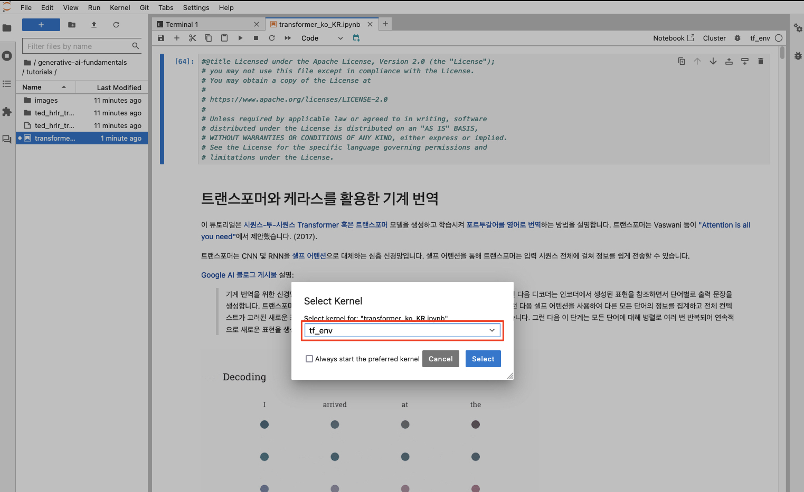

# Trnasformer with TensorFlow Workshop
> (참고)<br>
> 이 워크샵은 GPU가 갖추어지지 않은 일반적인 리눅스 인스턴스 (예: c5.9xlarge)에서도 수행해 볼 수 있도록 구성되었습니다.


## Agenda
1. DLAMI (딥러닝)) 인스턴스 생성 (CloudShell 사용)
2. 딥러닝 인스턴스 GPU 동작 확인 및 `JupyterLab` 설정
3. 텐서플로우를 활용한 트랜스포머 구현

## 1. DLAMI (딥러닝)) 인스턴스 생성 (CloudShell 사용)
### 1.1. 테라폼 설치 및 자원 코드 다운로드
1. 테라폼 설치
진행자가 제공한 AWS 계정, 혹은 Isengard AWS 계정 관리 콘솔에 로그인하여 ```CloudShell```을 실행한 후 아래 명령을 수행하여 ```테라폼 (Terraform)```을 설치해 줍니다.<br>

> (참고)<br>
> 테라폼의 라이선스 정책 변경 이후에 `Cloud9`이나 `CloudShell`에 기본적으로 내장되었던 테라폼이 제거되었습니다.

```bash
git clone https://github.com/tfutils/tfenv.git ~/.tfenv
mkdir ~/bin
ln -s ~/.tfenv/bin/* ~/bin/
tfenv install 1.6.6
tfenv use 1.2.5
terraform --version
```

> (참고)<br>
> `yum` 패키지 관리자가 설정되어 있는 `Cloud9`이나 `EC2` 환경에서는 아래 명령으로 테라폼을 좀 더 간단하게 설치할 수 있습니다.
```bash
sudo yum-config-manager --add-repo https://rpm.releases.hashicorp.com/AmazonLinux/hashicorp.repo
sudo yum -y install terraform
```

2. 자원 생성을 위해 소스 코드 다운로드<br>
실습 튜토리얼 파일에는 실습을 위한 리소스를 생성해주는 테라폼 Configuration 파일도 함께 포함되어 있습니다.<br>
아래와 같이 해당 리포지터리를 다운로드 받습니다.

```bash
cd ~
git clone https://github.com/shkim4u/Generative-AI-Fundamentals.git generative-ai-fundamentals
```

### 1.2. 실습을 실행할 자원 생성<br>
위 과정에서 다운로드 받은 IaC 코드에는 다음 자원이 포함되어 있습니다.

* DLAMI (Deep Learning AMI) 이미지로부터 구동되는 EC2 인스턴스
  * 인스턴스 타입은 `g5.16xlarge`로 설정되어 있지만 상황에 따라 변경 가능합니다.
  * OS는 `Amazon Linux 2`입니다.
* EC2 인스턴스를 위한 IAM Role 및 Instance Profile
* 네트워크 자원
  * VPC
  * Internet Gateway
  * NAT Gateway

아래와 같이 자원을 생성해 줍니다.
```bash
cd ~/generative-ai-fundamentals/terraform/deep-learning

terraform init
terraform apply -auto-approve
```

# 2. 딥러닝 인스턴스 GPU 동작 확인 및 `JupyterLab` 설정

## 환경 확인 및 설정

아래는 Amazon SageMaker에서 실습을 위한 환경을 설정하는 내용입니다.

1. `Amazon SageMaker` 콘솔에서 `빠른 설정 (Quick Setup)`으로 도메인과 사용자 프로파일을 생성한 후 `SageMaker Studio`를 실행합니다.
2. `JupyterLab` Space를 아래 사양으로 생성해 봅니다.
   * 인스턴스 타입 `ml.g4.24xlarge`, 스토리지 용량 50GB
   * 만약 생성이 실패하면 새로운 Space를 만들 필요 없이 인스턴스 타입을 순차적으로 `ml.g5.16xlarge`, `ml.g5.12xlarge`, `ml.g4dn.12xlarge` 낮추어 가면서 실행 시도해 봅니다.
   * (참고) `ml.g5` 계열 인스턴스는 자원가 어려운 탓인지 잘 만들어지지 않습니다.
3. (참고) GPU 인스턴스들에 내장된 NVIDIA GPU 타입
   * g4dn: T4
   * g5: A10
   * p4dn: A100: <https://aws.amazon.com/ko/ec2/instance-types/p4/>
   * p5: H100


아래 명령을 `JupyterLab` 환경의 터미널 창에서 실행하여 기본적인 환경을 확인합니다.

```bash
# 기본 환경을 확인합니다.
echo $HOME
echo $LD_LIBRARY_PATH 
ls -al /usr/local/
ls -al /etc/alternatives/cuda
ls -al /usr/local/cuda-11.8
python --version

# NVIDIA CUDA 드라이버를 업그레이드 합니다. 이 실습에서는 TensrorFlow 최신 버전 2.15.n을 사용하는데 CUDA 드라이버 12.2와 호환됩니다.
# 참고: 
# - https://developer.nvidia.com/cuda-12-2-0-download-archive?target_os=Linux&target_arch=x86_64&Distribution=Ubuntu&target_version=22.04&target_type=deb_network
# - https://arinzeakutekwe.medium.com/how-to-configure-nvidia-gpu-to-work-with-tensorflow-2-on-aws-sagemaker-1be98b9db464
# 설치에는 약 10분 정도 소요되며 TensorFlow + GPU의 동작에는 이상이 없음이 확인되었습니다 (DLAMI EC2 인스턴스의 경우).
# SageMaker의 경우에는 Root Access가 허용되지 않으므로 아래 명령어는 수행할 필요가 없거나 마지막에 몇몇 에러가 표출될 수 있습니다.
wget https://developer.download.nvidia.com/compute/cuda/repos/ubuntu2204/x86_64/cuda-keyring_1.1-1_all.deb
sudo apt-get update
sudo apt-get -y install cuda

python
# 파이썬 환경에서 아래 명령으로 TensorFlow 환경을 확인합니다.
import tensorflow as tf
from tensorflow.python.client import device_lib

print(tf.__version__)
print(tf.test.is_built_with_cuda())

print(device_lib.list_local_devices())
print("Num GPUs Available: ", len(tf.config.list_physical_devices('GPU')))
tf.test.gpu_device_name()

# 아래는 NVIDIA GPU를 사용하기 위한 코드이며, SageMaker 인스턴스나 DLAMI를 사용할 경우 수행할 필요가 없습니다.
# SageMaker에서 TensorFlow가 GPU를 인식하지 못할 때만 실행해 줍니다.
# !sudo apt install -y nvidia-cuda-toolkit
# !export LD_LIBRARY_PATH=/usr/local/cuda/targets/x86_64-linux/lib:$LD_LIBRARY_PATH

# !CUDNN_PATH=$(dirname $(python -c "import nvidia.cudnn;print(nvidia.cudnn.__file__)"))
# !export LD_LIBRARY_PATH=$CUDNN_PATH/lib:/opt/conda/lib/python3.10/site-packages/tensorrt_libs:$LD_LIBRARY_PATH:
# !/sbin/ldconfig -N -v $(sed 's/:/ /' <<< $LD_LIBRARY_PATH) 2>/dev/null
```


JupyterLab 환경의 터미널 창에서 실습을 안내할 Git Repository를 Clone합니다.

```bash
git clone https://github.com/shkim4u/generative-ai-fundamentals
cd generative-ai-fundamentals
rm -rf .git
# python -m venv --copies tf_env
python -m venv tf_env
source tf_env/bin/activate
python -m pip install --upgrade pip

pip install protobuf~=3.20.3
pip install tensorflow[and-cuda]
# pip install tensorrt
pip install tensorflow_datasets
pip install tensorflow-text
pip install matplotlib
pip install ipywidgets

pip install ipykernel
python -m ipykernel install --user --name=tf_env

sudo initctl restart jupyter-server --no-wait

# (참고) Jupyter Notebook 커널 삭제
# jupyter kernelspec uninstall tf_env
sudo initctl restart jupyter-server --no-wait
```


Python 가상 환경을 설정합니다.

~~위 과정을 수행한 후에 Jupyter Notebook의 커널을 재시작해 줍니다.~~


(참고) 아래와 같이 `Torch` 라이브러리를 사용할 경우 GPU 가용 상태를 확인할 수 있습니다.

# 아래는 SageMaker GPU 인스턴스 (g4dn.16xlarge, g5.24xlarge 등) 상에서 실행하는 경우에만 필요한 코드입니다

# GPU 상태 확인

%pip install torch
import torch

print(f'\nAvailable cuda = {torch.cuda.is_available()}')
print(f'\nGPUs availables = {torch.cuda.device_count()}')
print(f'\nCurrent device = {torch.cuda.current_device()}')
print(f'\nCurrent Device location = {torch.cuda.device(0)}')
print(f'\nName of the device = {torch.cuda.get_device_name(0)}')

# Check NVIDIA GPU

!nvidia-smi


`JupyterLab` 환경의 웹 UI에서 Clone 받은 경로로 이동한 후 "transformer_ko_KR.ipynb" 파일 (이 파일)을 더블클릭하여 노트북을 시작합니다.

그리고 Jupyter Notebook 커널을 위에서 설정한 `tf_env`로 설정해 줍니다.




데이터세트를 로드하기 위해 [TensorFlow 데이터셋](https://tensorflow.org/datasets), 그리고 텍스트 처리를 위해 [TensorFlow 텍스트](https://www.tensorflow.org/text)를 설치합니다:

# Install the most recent version of TensorFlow to use the improved masking support for `tf.keras.layers.MultiHeadAttention`

# [2023-12-16] 아래 설치 명령은 위 환경 설정부분으로 옮겨졌습니다

# !pip uninstall -y -q tensorflow keras tensorflow-estimator tensorflow-text

# %pip install protobuf~=3.20.3

## %pip install tensorflow==2.12.1 # SageMaker의 CUDA 버전에 맞는 2.12.1 버전을 설치합니다. -> 가상환경에서는 GPU 인식 실패, LD_LIBRARY_PATH 재설정 필요할 듯

# %pip install tensorflow[and-cuda]

# %pip install tensorrt

# %pip install tensorflow_datasets

# %pip install tensorflow-text

# %pip install matplotlib

# %pip install ipywidgets

# 아래 tf.keras.utils.plot_model() 명령이 수행되기 위해서는 미리 pydot, graphviz를 설치해야 합니다

# 필요하면 Jupyter 커널을 재시작합니다

# %pip install pydot graphviz

# 3. 텐서플로우를 활용한 트랜스포머 구현
