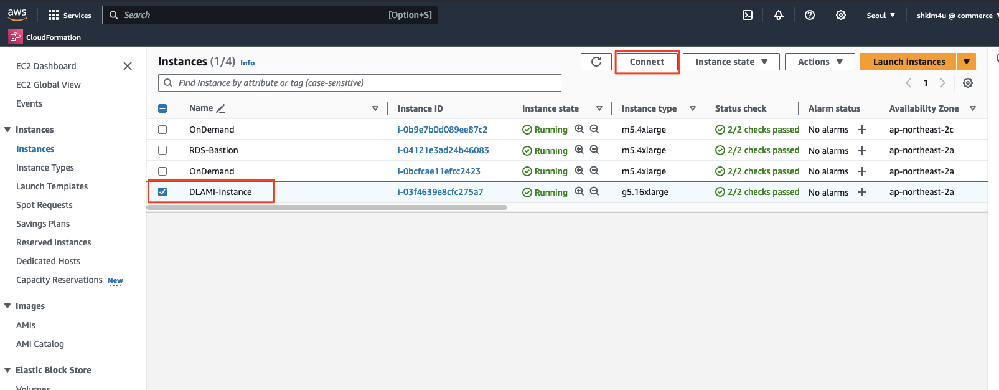

# Trnasformer with TensorFlow Workshop
> (참고)<br>
> 이 워크샵은 GPU가 갖추어지지 않은 일반적인 리눅스 인스턴스 (예: c5.9xlarge)에서도 수행해 볼 수 있도록 구성되었습니다.


## Agenda
1. DLAMI (딥러닝) 인스턴스 생성 (CloudShell 사용)
2. 딥러닝 인스턴스 GPU 동작 확인 및 `Jupyter Notebook` 설정
3. 텐서플로우를 활용한 트랜스포머 구현

## 1. DLAMI (딥러닝) 인스턴스 생성 (CloudShell 사용)
### 1.1. 테라폼 설치 및 자원 코드 다운로드
1. 테라폼 설치
진행자가 제공한 AWS 계정, 혹은 Isengard AWS 계정 관리 콘솔에 로그인하여 ```CloudShell```을 실행한 후 아래 명령을 수행하여 ```테라폼 (Terraform)```을 설치해 줍니다.<br>

> (참고)<br>
> 테라폼의 라이선스 정책 변경 이후에 `Cloud9`이나 `CloudShell`에 기본적으로 내장되었던 테라폼이 제거되었습니다.

```bash
git clone https://github.com/tfutils/tfenv.git ~/.tfenv
mkdir ~/bin
ln -s ~/.tfenv/bin/* ~/bin/
tfenv install 1.6.6
tfenv use 1.2.5
terraform --version
```

> (참고)<br>
> `yum` 패키지 관리자가 설정되어 있는 `Cloud9`이나 `EC2` 환경에서는 아래 명령으로 테라폼을 좀 더 간단하게 설치할 수 있습니다.
```bash
sudo yum-config-manager --add-repo https://rpm.releases.hashicorp.com/AmazonLinux/hashicorp.repo
sudo yum -y install terraform
```

2. 자원 생성을 위해 소스 코드 다운로드<br>
실습 튜토리얼 파일에는 실습을 위한 리소스를 생성해주는 테라폼 Configuration 파일도 함께 포함되어 있습니다.<br>
아래와 같이 해당 리포지터리를 다운로드 받습니다.

```bash
cd ~
git clone https://github.com/shkim4u/Generative-AI-Fundamentals.git generative-ai-fundamentals
```

### 1.2. 실습을 실행할 자원 생성<br>
위 과정에서 다운로드 받은 IaC 코드에는 다음 자원이 포함되어 있습니다.

* DLAMI (Deep Learning AMI) 이미지로부터 구동되는 EC2 인스턴스
  * 인스턴스 타입은 `g5.16xlarge`로 설정되어 있지만 상황에 따라 변경 가능합니다.
  * OS는 `Amazon Linux 2`입니다.
* EC2 인스턴스를 위한 IAM Role 및 Instance Profile
* 네트워크 자원
  * VPC
  * Internet Gateway
  * NAT Gateway

아래와 같이 자원을 생성해 줍니다.
```bash
cd ~/generative-ai-fundamentals/terraform/deep-learning

terraform init
terraform apply -auto-approve
```

## 2. 딥러닝 인스턴스 GPU 동작 확인 및 `Jupyter Notebook` 설정

### 2.1. 딥러닝 인스턴스 접속, GPU 동작 확인, CUDA 라이브러리 설정

테라폼의 자원 생성이 완료되면 `DLAMI (Deep Learning AMI)` 기반의 EC2 인스턴스가 하나 생성됩니다. 이 인스턴스는 모델 학습을 빠르게 수행하기 위하여 GPU를 활용할 수 있는 `g5.16xlarge` 타입으로 생성되어 있을 것입니다.

> (참고) GPU 인스턴스들에 내장된 NVIDIA GPU 타입
> - g4dn: T4
> - g5: A10
> - p4dn: A100: <https://aws.amazon.com/ko/ec2/instance-types/p4/>
> - p5: H100

> (참고) `SageMaker Studio`에서의 GPU 지원 컴퓨팅 리소스
> `SageMaker Studio`에서는 GPU 지원 인스턴스 타입은 `ml.g5.24xlarge`와 같은 이름을 가집니다.
> 하지만 `SageMaker Studio`에서는 GPU 지원 인스턴스의 생성에 제약이 좀 더 심한편으로 잘 만들어지지 않습니다. 만약 생성이 실패하면 새로운 Space를 만들 필요 없이 인스턴스 타입을 순차적으로 `ml.g5.16xlarge`, `ml.g5.12xlarge`, `ml.g4dn.12xlarge` 낮추어 가면서 생성시도해 봅니다.


1. `Amazon EC2` 콘솔에서 `SSM Connect` 기능을 사용하여 인스턴스에 로그인합니다.<br>
   <br>
   <br>
   
2. DLAMI 인스턴스 내에서 실습을 수행할 수 있도록 리포지터리를 다시 클론합니다. (앞서 수행한 `git clone` 명령은 `CloudShell`에서 수행한 것이고, 지금은 실제 실습을 수행할 DLAMI 인스턴스에서 수행하는 것입니다.)

   ```bash
   cd ~
   git clone https://github.com/shkim4u/Generative-AI-Fundamentals.git generative-ai-fundamentals
   ```

3. `nvidia-smi` 명령어를 통해 GPU 동작을 확인합니다.
   ```bash
   nvidia-smi
   ```
   
   
4. TensorFlow + GPU 라이브러리 상태를 확인합니다.
   ```bash
   cd ~
   # 기본 환경을 확인합니다
   echo $HOME
   echo $LD_LIBRARY_PATH
   ls -al /usr/local/
   ls -al /etc/alternatives/cuda
   ls -al /usr/local/cuda-11.8
   python --version

   # TensorFlow + GPU 동작 확인
   cd ~/generative-ai-fundamentals
   python resources/scripts/check-tensorflow-gpu.py
   ```

### 2.2. `Jupyter Notebook` 설정

이 리포지터리에는 Foundation Model에 활용되는 Transformer를 TensorFlow를 통해 이해할 있도록 Jupyter Notebook 파일이 포함되어 있습니다.<br>

DLAMI 상에서 Jupyter Notebook 실행할 수 있는 환경을 구성하기 위하여 아래 명령을 수행합니다.

```bash
cd ~/generative-ai-fundamentals
# Git Upstream 단절; 이제부터 많은 변화가 수반됨
rm -rf .git
python3 -m venv .venv
source .venv/bin/activate
python -m pip install --upgrade pip

pip uninstall -y urllib3
pip install 'urllib3<2.0'

pip install jupyterlab

pip install protobuf~=3.20.3
pip install tensorflow[and-cuda]
# pip install tensorrt
pip install tensorflow_datasets
pip install tensorflow-text
pip install matplotlib
pip install ipywidgets

nohup jupyter lab --ip 0.0.0.0 &
tail -f nohup.out

# `CTRL+C`를 눌러 Tail로 부터 탈출
```

위를 수행하면 URL이 표시되는데, 이 URL 포함된 인증 토큰을 메모해 두고 Jupyter Notebook 접속할 때 사용합니다.<br>
Jupyter Notebook 접속 주소는 아래 명령을 통해 얻을 수 있습니다.<br>

```bash
export EC2_INSTANCE_ID=$(aws ec2 describe-instances --region ap-northeast-2 --filters Name=tag:Name,Values="*DLAMI-Instance*" Name=instance-state-name,Values=running --query "Reservations[*].Instances[*].InstanceId" --output text) && echo $EC2_INSTANCE_ID

# Retrieve the public IP address of EC2 instance with AWS CLI.
export EC2_INSTANCE_IP=$(aws ec2 describe-instances --instance-ids $EC2_INSTANCE_ID --region ap-northeast-2 --query "Reservations[*].Instances[*].PublicIpAddress" --output text) && echo $EC2_INSTANCE_IP

echo "http://$EC2_INSTANCE_IP:8888"
```

## 3. 텐서플로우를 활용한 트랜스포머 구현

이후 과정은 Jupyter Notebook에 접속한 후에 진행자의 안내에 따라 수행합니다.
